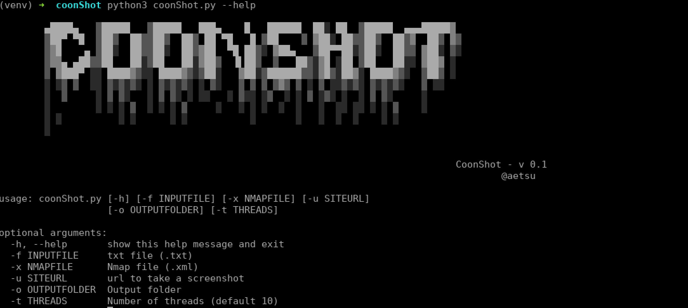
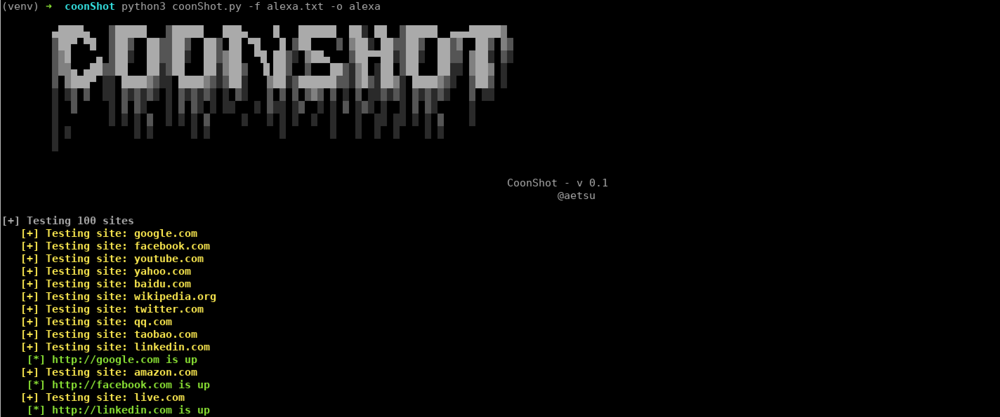

# CoonShot
[](https://www.python.org/downloads/)

A Python script to take screenshots of web pages from a url, a file with urls or an nmap output file (.xml).


## Requirements
Tested on Kali Linux 2019.2:
```bash
git clone https://github.com/Aetsu/coonShot.git
cd coonShot
apt install python3-venv
python3 -m venv venv
source venv/bin/activate
pip3 install -r requirements.txt --no-cache-dir
# Download linux geckodriver
mkdir driver
wget -P driver https://github.com/mozilla/geckodriver/releases/download/v0.24.0/geckodriver-v0.24.0-linux64.tar.gz
tar xvzf driver/geckodriver-v0.24.0-linux64.tar.gz -C driver
rm driver/geckodriver-v0.24.0-linux64.tar.gz
# Download tested Firefox version (59.0.3)
wget https://ftp.mozilla.org/pub/firefox/releases/59.0.3/linux-x86_64/en-US/firefox-59.0.3.tar.bz2
tar xvjf firefox-59.0.3.tar.bz2
rm firefox-59.0.3.tar.bz2
```

## Usage

- Take a screenshot of a web page:
```bash
python3 coonShot.py -u <url>
```
- Take a screenshot from a list of urls inside a file and store the output in a folder:
```bash
python3 coonShot.py -f <filename> -o <output_folder>
```

